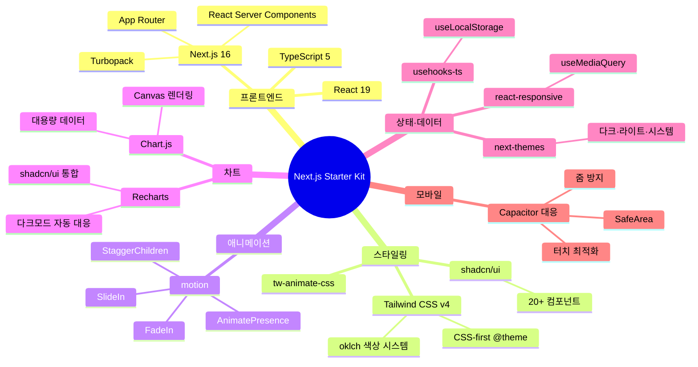
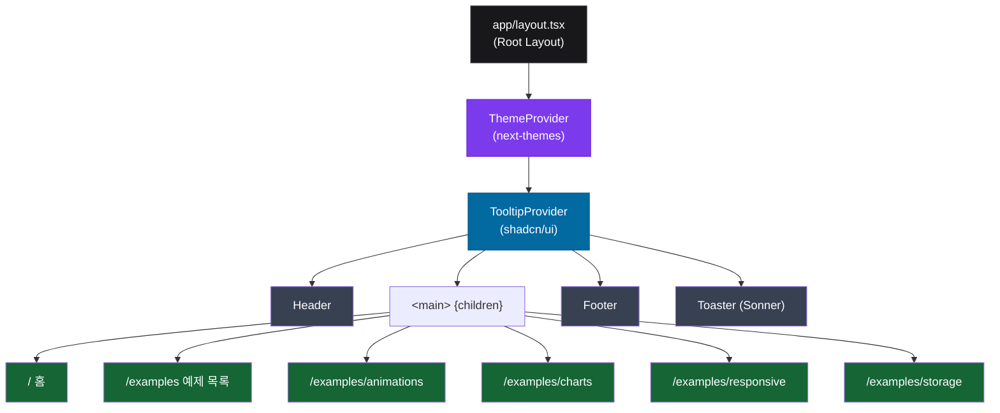
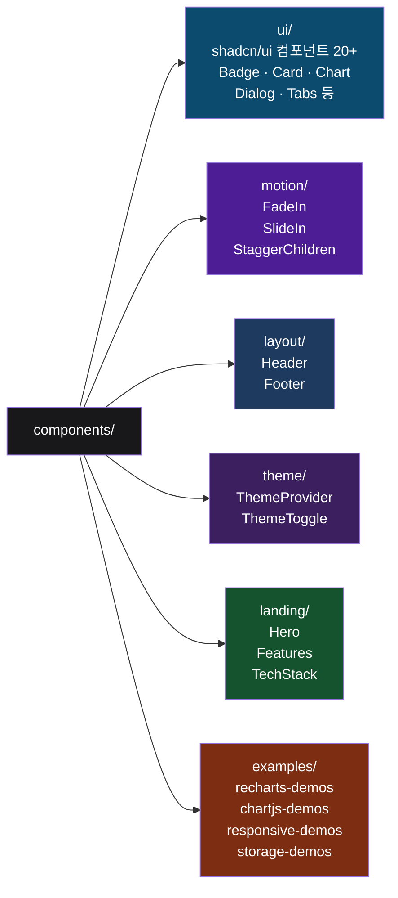
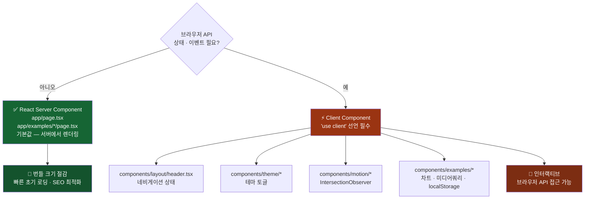
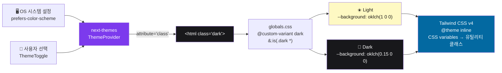
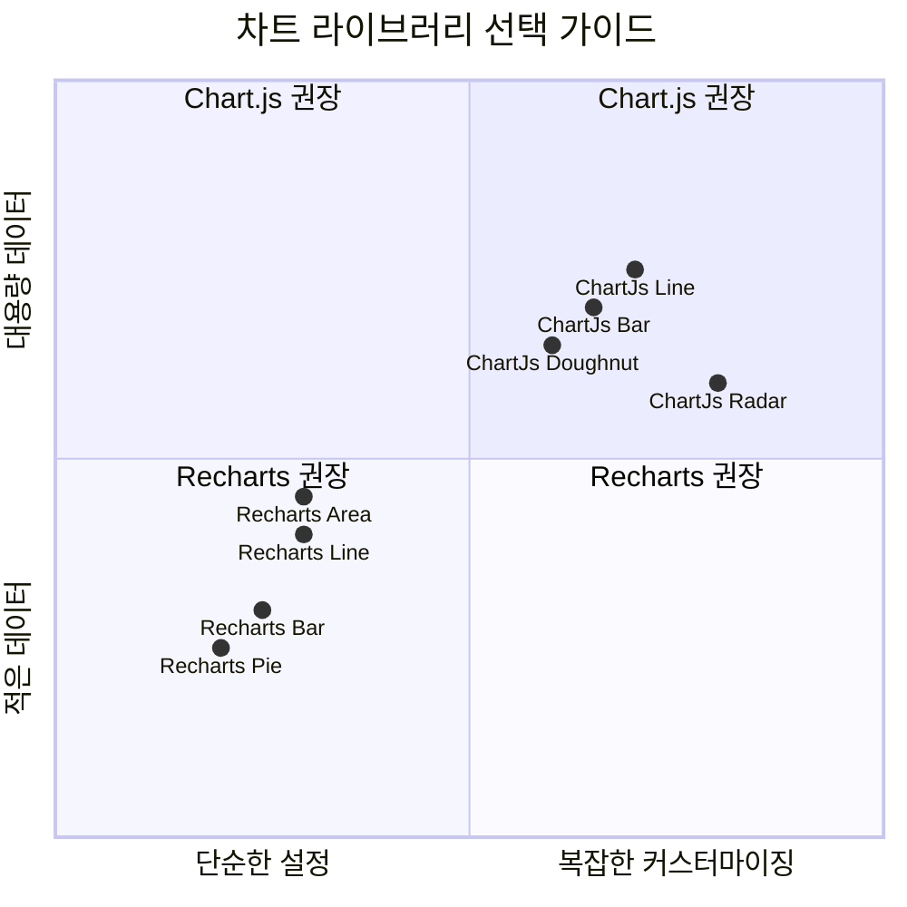
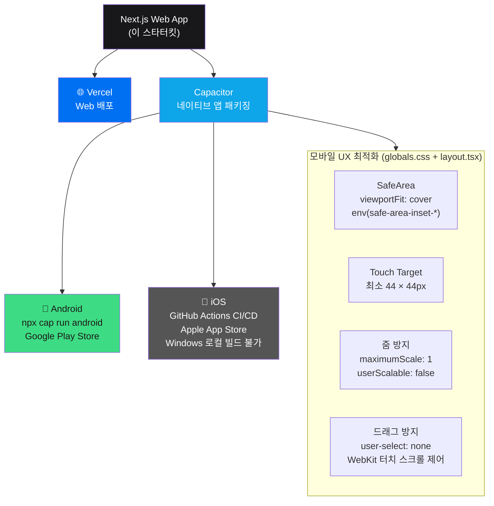
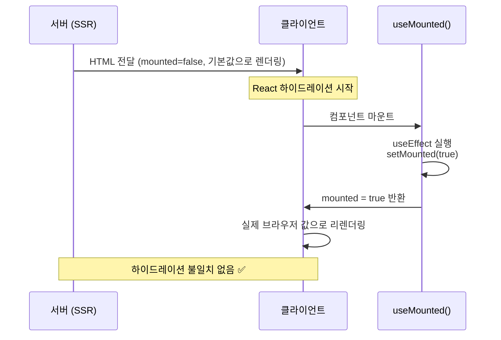

<div align="center">

# ⚡ Next.js Starter Kit

**프로덕션 레디 Next.js 16 스타터킷**

[](https://nextjs.org)
[](https://react.dev)
[](https://www.typescriptlang.org)
[](https://tailwindcss.com)
[](https://ui.shadcn.com)
[](LICENSE)

Next.js 16 · TypeScript · Tailwind CSS v4 · shadcn/ui · Motion · Recharts · Chart.js가 사전 구성된
모던 웹 + 모바일 앱(Capacitor) 스타터킷입니다.

[**예제 보기**](#-예제-페이지) · [**빠른 시작**](#-빠른-시작) · [**아키텍처**](#-아키텍처)

</div>

---

## 📦 기술 스택



---

## 🏗 아키텍처

### 앱 레이아웃 구조



### 컴포넌트 계층 구조



### RSC vs 클라이언트 컴포넌트 분리 전략



---

## 🎨 테마 시스템



---

## 📊 차트 시스템



| 항목 | Recharts | Chart.js |
|------|:--------:|:--------:|
| 렌더링 방식 | SVG | Canvas |
| shadcn/ui 통합 | ✅ | ❌ |
| 다크모드 자동 대응 | ✅ CSS variables | 수동 색상 지정 |
| 권장 용도 | 대시보드·일반 차트 | 복잡한 커스터마이징·대용량 |

---

## 📱 모바일 퍼스트 & 배포 전략



---

## 🔄 SSR 하이드레이션 패턴

브라우저 API에 의존하는 값은 서버/클라이언트 간 렌더링 불일치가 발생합니다. `useMounted()` 훅으로 해결합니다.



**적용 대상:** `useMediaQuery` (react-responsive) · `localStorage` 의존 UI · 테마 토글

---

## 🚀 빠른 시작

```bash
# 저장소 클론
git clone https://github.com/SHIN-HANBEEN/NextJs-Starter-Kit.git
cd NextJs-Starter-Kit

# 의존성 설치
npm install

# 개발 서버 실행 (Turbopack)
npm run dev
```

브라우저에서 [http://localhost:3000](http://localhost:3000)을 열어 확인하세요.

### 주요 명령어

```bash
npm run dev      # 개발 서버 (Turbopack)
npm run build    # 프로덕션 빌드
npm run start    # 프로덕션 서버
npm run lint     # ESLint 검사
```

---

## 📁 프로젝트 구조

```
├── app/
│   ├── layout.tsx              # 루트 레이아웃 (ThemeProvider, Header, Footer)
│   ├── page.tsx                # 홈 페이지
│   ├── globals.css             # 전역 스타일 (Tailwind v4 @theme, 다크모드)
│   └── examples/
│       ├── page.tsx            # 예제 목록
│       ├── animations/         # motion 애니메이션 예제
│       ├── charts/             # Recharts + Chart.js 예제
│       ├── responsive/         # react-responsive 예제
│       └── storage/            # useLocalStorage 예제
├── components/
│   ├── ui/                     # shadcn/ui 컴포넌트 (20+)
│   ├── motion/                 # 재사용 애니메이션 래퍼 (FadeIn, SlideIn, StaggerChildren)
│   ├── layout/                 # Header, Footer
│   ├── theme/                  # ThemeProvider, ThemeToggle
│   ├── landing/                # 홈 페이지 섹션 컴포넌트
│   └── examples/               # 예제 페이지 클라이언트 컴포넌트
├── hooks/
│   └── use-mounted.ts          # SSR 하이드레이션 안전 훅
└── lib/
    └── constants.ts            # 전역 상수 (NAV_LINKS, SITE_CONFIG 등)
```

---

## 🖥 예제 페이지

| 예제 | 경로 | 핵심 기술 |
|------|------|-----------|
| 애니메이션 | `/examples/animations` | `motion` — FadeIn, SlideIn, Stagger, 제스처, AnimatePresence |
| 차트 | `/examples/charts` | `recharts` + `chart.js` — Bar, Line, Area, Pie, Radar, Doughnut |
| 반응형 로직 | `/examples/responsive` | `react-responsive` — useMediaQuery, 브레이크포인트 실시간 감지 |
| 브라우저 저장소 | `/examples/storage` | `usehooks-ts` — useLocalStorage, 객체 저장, 폼 자동저장 |

---

## 🛠 MCP 도구 (Claude Code)

이 프로젝트는 Claude Code와 함께 다음 MCP 서버를 활용합니다:

| MCP | 용도 |
|-----|------|
| [`@playwright/mcp`](https://github.com/microsoft/playwright-mcp) | 브라우저 자동화, 런타임 오류 수집 및 UI 테스트 |
| [`mcp-mermaid`](https://github.com/hustcc/mcp-mermaid) | Mermaid 다이어그램 생성 및 PNG/SVG 내보내기 |

---

<div align="center">

Made with ❤️ using **Next.js** · **React** · **TypeScript** · **Tailwind CSS v4** · **shadcn/ui**

</div>
